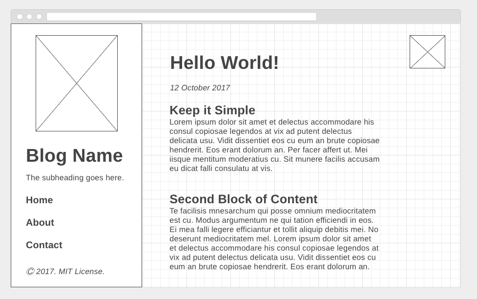

# Simple Site 2

For this drill, you will create a landing page for a blog. Create your `index.html` and `styles.css` files in this, the version-2 directory.

Create the blog's landing page from the screenshot below, given the following
constraints:

* The layout should be done with floats or flex-box.
* The markup should use `semantic` HTML5
* The code should use proper indentation
* Use git through the CLI and have appropriate commit messages

Note: This wireframe was inspired by [Hydeout Jekyll Theme](https://fongandrew.github.io/hydeout/)
