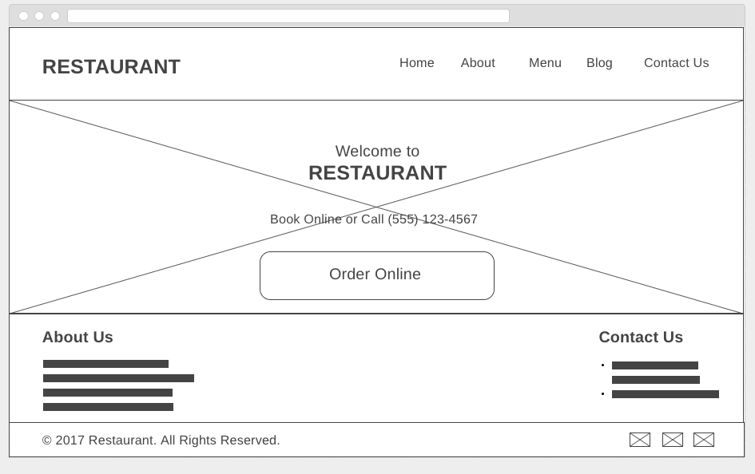
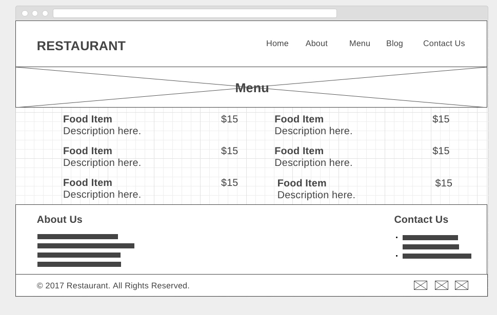

# Simple Site 3

For this drill, you will multi-page website for a restaurant. Write your code in the  `index.html` and `main.css` files in this directory.

Create the two pages from the screenshots below, given the following
constraints:

* The layout should be done with floats or flex-box.
* The markup should use `semantic` HTML5
* The code should use proper indentation
* Use git through the CLI and have appropriate commit messages

